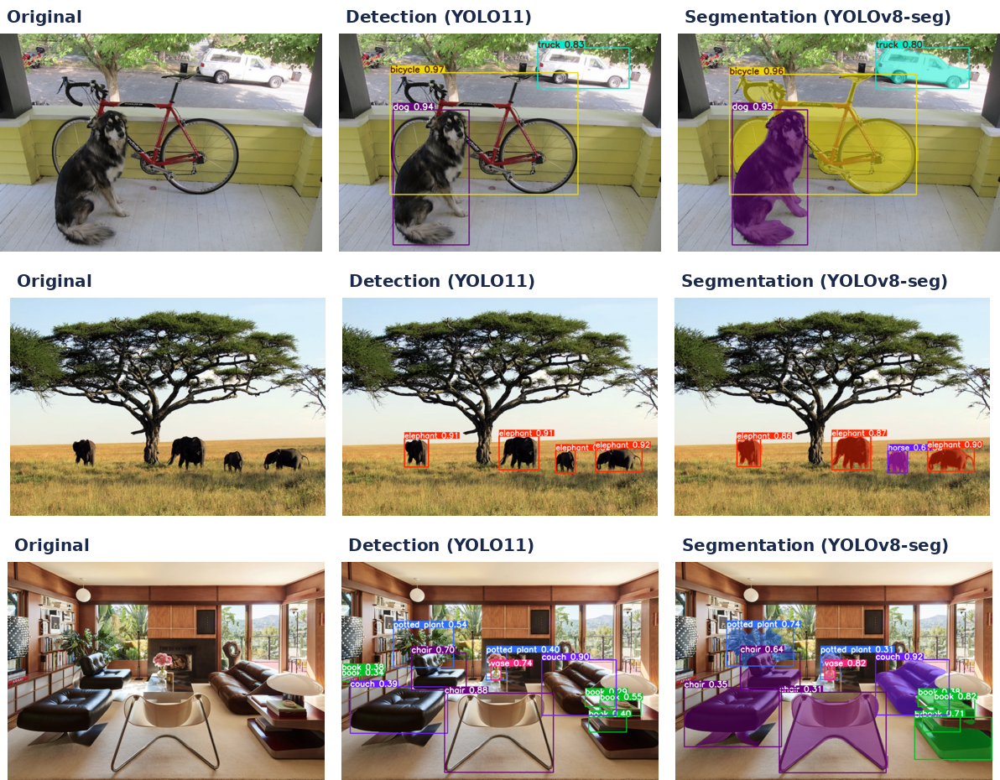
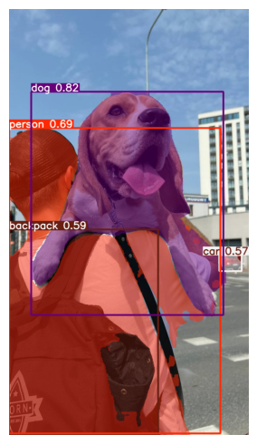
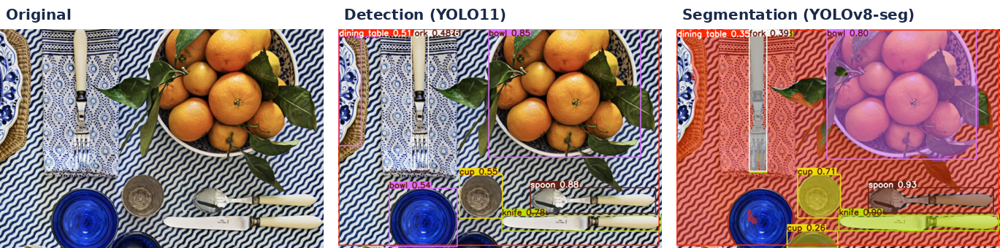
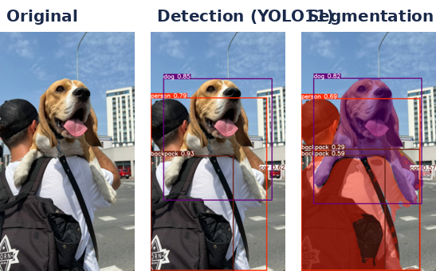

# 🎯 Object Detection & Instance Segmentation with YOLO

[](https://colab.research.google.com/github/MMujtabaX/CV-OD/blob/main/CV_OD_C16.ipynb)


Hands-on exploration of **object detection** and **instance segmentation** with pretrained Ultralytics YOLO models: running inference, reading the raw outputs (bounding boxes, masks, class IDs), tuning inference settings, and building a practical **object-counting** use case.

<p align="center">
  
</p>

## 🔍 Detection vs Segmentation

| Task | Output | Answers |
|------|--------|---------|
| **Object detection** | A bounding box + class + confidence per object | *What* is in the image and roughly *where* |
| **Instance segmentation** | A pixel-level mask for each individual object | The exact *shape* of each object, separating overlapping instances |

## 🧰 Models Used

All models are pretrained on **COCO** (80 everyday object classes).

| Model | Task | Used for |
|-------|------|----------|
| `yolo11l` | Detection | Main detection results |
| `yolov8l-seg` | Instance segmentation | Pixel masks and inference settings |
| `yolov8m` | Detection | Object counting |

## 📚 What's Covered

### 1. Object detection
YOLO11-L detected objects across 5 varied scenes: a porch, a savanna, a living room, a dining table and a street.

### 2. Instance segmentation
YOLOv8-L-seg produces a mask for each object, not just a box. Masks separate overlapping objects, like the dog in front of the bicycle.

### 3. Understanding the results
Each result exposes its raw tensors, which is what you'd use to build an application:

```python
result.boxes.xyxy    # box corners in pixels
result.boxes.xyxyn   # box corners normalized to [0, 1]
result.boxes.conf    # confidence scores
result.boxes.cls     # class IDs
result.masks.data    # per-object binary masks (segmentation)
```

### 4. Inference settings

```python
model(image, conf=0.3, max_det=10, iou=0.7, classes=[0])
```

| Setting | Effect |
|---------|--------|
| `conf` | Minimum confidence; filters out weak detections |
| `max_det` | Caps the number of detections per image |
| `iou` | Non-maximum suppression threshold for removing duplicate boxes |
| `classes` | Keeps only chosen classes (e.g. `[0]` = person only) |

<p align="center">
  
</p>

### 5. Use case: object counting
Turning detections into counts per image, which is the basis for applications like inventory checks, traffic counting or crowd monitoring:

| Image | Objects counted (YOLOv8m, conf ≥ 0.3) |
|-------|---------------------------------------|
| Savanna | 🐘 4 elephants |
| Living room | 🛋️ 3 couches · 3 books · 1 potted plant · 1 vase |
| Place setting | ☕ 2 cups · 2 knives · 1 spoon · 1 bowl · 1 dining table |
| Street scene | 🧍 1 person · 🚗 1 car · 🐕 1 dog · 🎒 2 backpacks |

```python
class_ids = result.boxes.cls.cpu().numpy().astype(int)
unique, counts = np.unique(class_ids, return_counts=True)
object_counts = {result.names[i]: c for i, c in zip(unique, counts)}
```

## 🖼️ More Results

<p align="center">
  
</p>
<p align="center">
  
</p>

## 💡 Observations

- **Different models count differently.** On the same place setting, YOLO11-L found 2 spoons and 3 bowls, while YOLOv8-L-seg found 1 spoon and 1 bowl. Model choice affects downstream counts.
- **Segmentation can introduce false positives.** On the savanna image, YOLOv8-L-seg reported an extra **horse** alongside the 4 elephants, a detection the YOLO11 model didn't make.
- **`conf` is a precision/recall dial.** Raising it removes weak detections, but can drop real small objects.
- **Pretrained COCO models only know 80 classes.** Detecting anything else (e.g. specific products or defects) requires fine-tuning on a custom dataset.

## 🔮 Next Steps

- Pose estimation with `yolo11n-pose` (human keypoints)
- Fine-tuning YOLO on a custom dataset
- Object tracking and counting on video

## 🚀 Run It

Click the **Open in Colab** badge above and select a **GPU runtime**, then run all cells. The sample images and YOLO weights download automatically.

```bash
pip install ultralytics opencv-python matplotlib
```

## 🙏 Acknowledgements

Based on computer vision course material; notebook adapted and documented by me. Models by [Ultralytics](https://github.com/ultralytics/ultralytics).

## 👤 Author

**Muhammad Mujtaba Khan Suri** — CS @ UBIT, University of Karachi
[GitHub](https://github.com/MMujtabaX)
